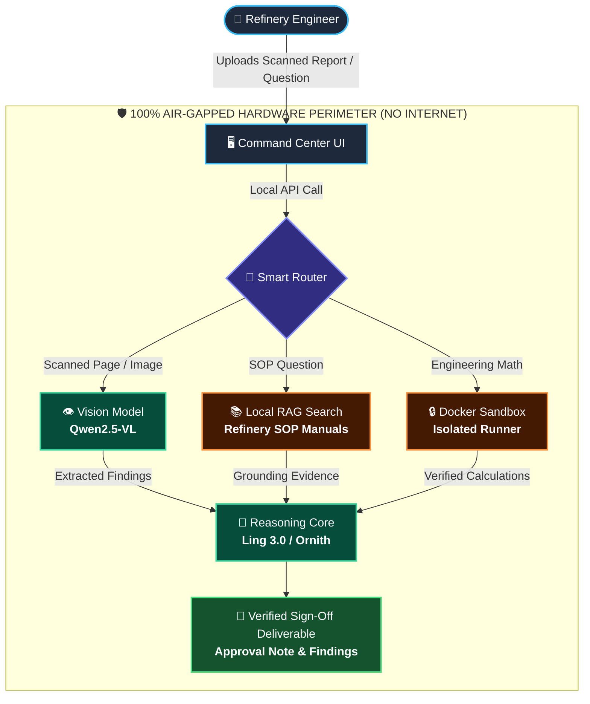

# 🛡️ MRPL Sovereign AI Workbench
### *Air-Gapped Industrial Knowledge & Multimodal Agentic AI*
**Smart India Hackathon 2026 — Problem Statement: SIH26117**

[](docs/PROJECT_GUIDE.md)
[](configs/models.yaml)
[](scripts/network_check.py)
[](configs/models.yaml)

---

> [!IMPORTANT]
> ### 🏭 The Executive Summary for Jury & Leadership
> **Confidential refinery documents must never leave the facility.**
> 
> The **MRPL Sovereign AI Workbench** is a 100% self-hosted intelligence platform designed specifically for **Mangalore Refinery and Petrochemicals Limited**. It performs complex engineering document review, scanned inspection analysis, and SOP compliance checking **entirely on local organization hardware**—with mathematically proven zero external network transmission.

---

## ⚡ How It Works: The Sovereign Flow



---

## 🤖 The Multi-Model Squad

Rather than relying on one generic model for all tasks, the workbench deploys specialized, open-weight AI models tailored for distinct industrial jobs:

| Modality | Dedicated Model | Plain-English Role | Industrial Responsibility |
| :--- | :--- | :--- | :--- |
| **👁️ Vision** | `Qwen2.5-VL-3B` | **"The Eyes"** | Reads scanned inspection sheets, equipment photos, and P&ID drawings. |
| **🧠 Reasoning** | `Ling-3.0-tiny` / `Ornith-9B` | **"The Brain"** | Evaluates refinery standards, assesses risk, and formulates step-by-step sign-offs. |
| **💻 Coding** | `Qwen2.5-Coder` / `Ling-3.0` | **"The Engineer"** | Writes and executes verified calculations (flow rates, tolerances) in an isolated container. |
| **🎙️ Voice (ASR)** | `Qwen3-ASR-1.7B` | **"The Ears"** | Transcribes field voice notes and radio logs from maintenance crews. |
| **🔍 Memory (RAG)** | `nomic-embed-text` | **"The Archivist"** | Indexes and retrieves paragraphs from hundreds of refinery manuals in milliseconds. |

---

## 🌟 Core Pillars for Industrial Operations

| Pillar | How It Works | Industrial Benefit |
| :--- | :--- | :--- |
| **📄 Scanned Document Intelligence** | Automatically detects whether a PDF page is digital text or a scanned raster, rendering scanned sheets to local computer vision. | Eliminates manual re-typing of physical plant inspection records. |
| **🛡️ Zero-Leakage Sandbox** | Runs generated math and analysis scripts inside a locked Docker container with `--network=none` and strict RAM limits. | Safe deterministic calculations with no risk to plant control systems. |
| **🔍 Grounded SOP Search** | Uses Hybrid Retrieval (Dense Vector + BM25 keyword matching) to cite exact pages and paragraphs. | Eliminates AI hallucinations; every finding is backed by refinery policy. |
| **🔏 Cryptographic Audit Trail** | Signs every prompt, tool execution, and output with Ed25519 asymmetric digital keys stored in an append-only ledger. | Complete non-repudiation for safety audits and regulatory compliance. |

---

## 🚀 Quickstart: 3 Simple Steps

### 1️⃣ Clone & Configure
```bash
cp .env.example .env
# Default is already configured for local Ollama runtime:
# MODEL_BACKEND="ollama"
```

### 2️⃣ Start the Local Backend
```bash
cd apps/backend
python -m venv venv && source venv/bin/activate  # Or: venv\Scripts\activate on Windows
pip install -r requirements.txt
uvicorn app.main:app --port 8000
```
*Live API documentation: [http://localhost:8000/docs](http://localhost:8000/docs)*

### 3️⃣ Start the Command Center UI
```bash
cd apps/frontend
npm install
npm run dev
```
*Open workbench UI: [http://localhost:5173](http://localhost:5173)*

---

## 🔎 Independent Air-Gap Verification

To verify that the workbench never sends data over the internet during operation:

```bash
# Run the automated air-gap verification script
python scripts/network_check.py
```

> **Verdict:** `0 external AI calls` • `0 telemetry packets` • `100% Local Loopback`

---

## 📂 Minimal Project Layout

```text
SIH26117/
├── apps/
│   ├── backend/               # FastAPI core, multi-model router & agent loop
│   │   ├── app/agent/         # State graph & critic verification loop
│   │   ├── app/models/        # Local model adapters (Ollama, MLX, vLLM)
│   │   ├── app/rag/           # Local Qdrant vector store & BM25 hybrid search
│   │   ├── app/sandbox/       # Hardened Docker runner (--network=none)
│   │   └── app/security/      # Ed25519 audit logging & egress guard
│   └── frontend/              # High-speed tactical React command center
├── configs/
│   └── models.yaml            # Role catalog and serving backends
├── docs/
│   └── PROJECT_GUIDE.md       # Primary specification & single source of truth
└── scripts/
    ├── health_check.py        # Subsystem connectivity & diagnostics
    └── network_check.py       # Air-gap & zero-egress auditor
```

---

<div align="center">
  <sub>Built for <b>Mangalore Refinery and Petrochemicals Limited (MRPL)</b> • Smart India Hackathon 2026</sub>
</div>
