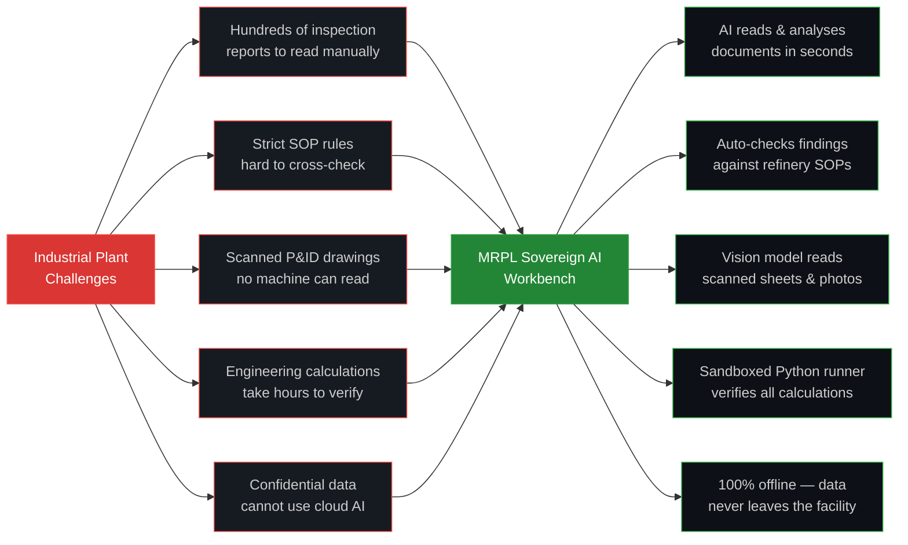
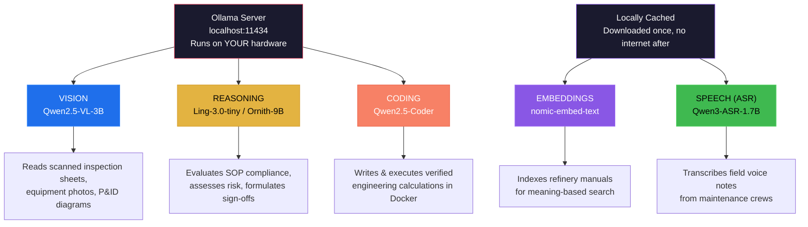
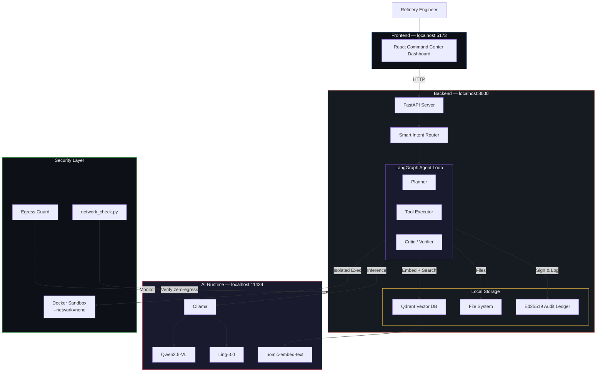
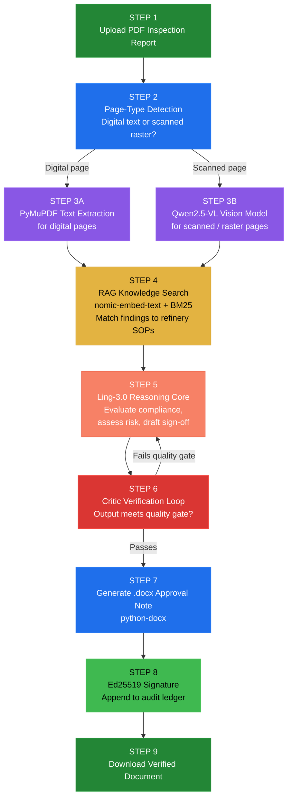
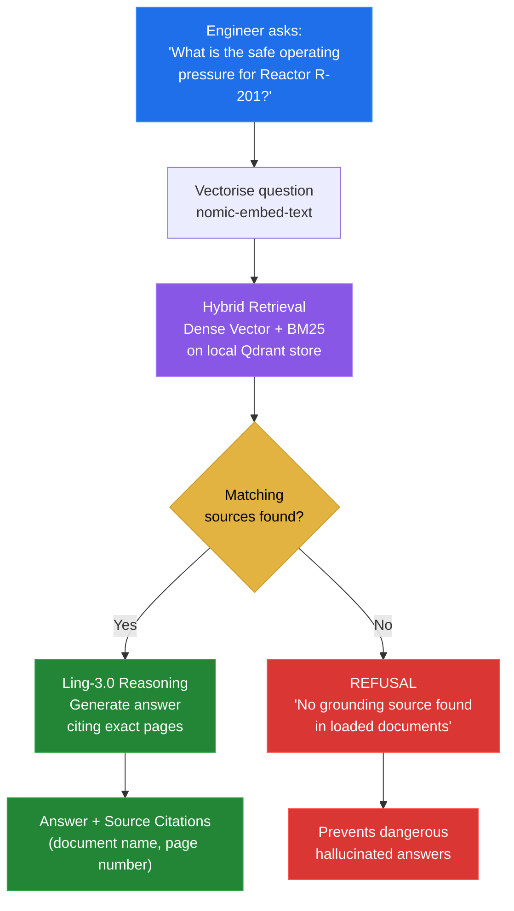
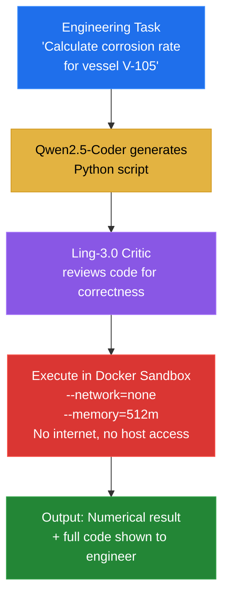
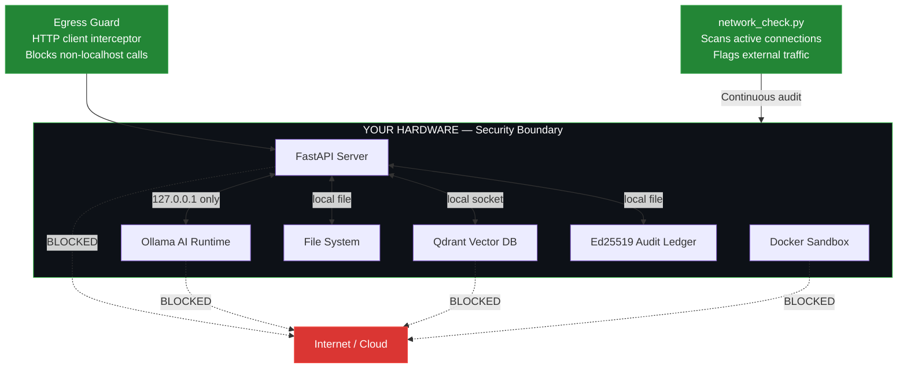
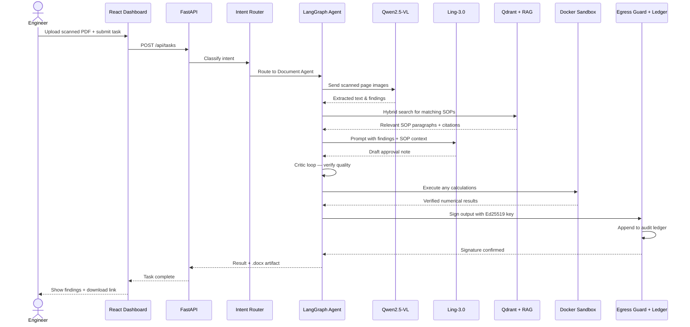

# MRPL Sovereign AI Workbench

### Problem Statement: **SIH26117** — Smart India Hackathon 2026

> **A self-hosted AI platform for MRPL refinery operations — all intelligence runs on your own hardware. No data ever leaves the facility.**

[](docs/PROJECT_GUIDE.md)
[](configs/models.yaml)
[](scripts/network_check.py)
[](configs/models.yaml)

---

## What Is This Project?



> **The #1 Rule:** Confidential MRPL data must remain inside the organisation's infrastructure at all times.

---

## Capabilities At A Glance

| # | Capability | Input | Output | Powered By |
|---|-----------|-------|--------|-----------|
| 1 | **Scanned Document Intelligence** | Scanned PDF inspection report | Verified sign-off approval note (.docx) | Vision Model + Reasoning Core |
| 2 | **SOP Knowledge Search** | Plain-English question | Cited answer from refinery manuals | RAG (Hybrid Dense + BM25) |
| 3 | **Multimodal Vision Analysis** | Equipment photo / P&ID drawing | Damage, hazard & component description | Qwen2.5-VL |
| 4 | **Sandboxed Code Execution** | Engineering calculation task | Verified Python result in isolated container | Qwen2.5-Coder + Docker |
| 5 | **Voice Note Transcription** | Field audio recording | Transcribed maintenance log | Qwen3-ASR |
| 6 | **Agentic Multi-Step Reasoning** | Complex refinery scenario | Step-by-step findings with critic loop | LangGraph + Ling-3.0 |
| 7 | **Cryptographic Audit Trail** | Any agent action | Ed25519-signed append-only ledger entry | Security Module |

---

## AI Models — All Running Locally



| Role | Model | Task | Runtime |
|------|-------|------|---------|
| Vision | `Qwen2.5-VL-3B` | Scanned page understanding, image analysis | Ollama (localhost) |
| Reasoning | `Ling-3.0-tiny` / `Ornith-9B` | SOP evaluation, risk assessment, sign-offs | Ollama (localhost) |
| Coding | `Qwen2.5-Coder` / `Ling-3.0` | Python generation, engineering calculations | Ollama (localhost) |
| Embeddings | `nomic-embed-text` | Document vectorisation for RAG | Ollama (localhost) |
| Voice (ASR) | `Qwen3-ASR-1.7B` | Field audio transcription | Local (cached) |

---

## System Architecture



---

## Flow 1: Scanned Document Intelligence (Hero Demo)

> Upload a scanned inspection report → get a signed-off approval note (.docx)



| Step | What Happens | Tool / Model |
|------|-------------|--------------|
| 1 | Engineer uploads scanned PDF | — |
| 2 | System detects each page: digital or scanned raster | PyMuPDF page analysis |
| 3A | Text pages: extract directly | PyMuPDF |
| 3B | Scanned pages: run through local vision model | Qwen2.5-VL-3B (Ollama) |
| 4 | Find matching SOP rules by meaning and keyword | nomic-embed-text + Qdrant BM25 |
| 5 | AI compares findings against SOP, drafts approval note | Ling-3.0 (Ollama) |
| 6 | Critic agent verifies output quality; re-tries if needed | LangGraph critic loop |
| 7 | Professional `.docx` Approval Note generated | python-docx |
| 8 | Output cryptographically signed, logged in ledger | Ed25519 (local key) |
| 9 | Engineer downloads the finished, verified document | — |

---

## Flow 2: SOP Knowledge Search

> Ask a plain-English question → get an answer grounded in your refinery manuals



> **Anti-Hallucination Policy:** If the AI cannot ground its answer in loaded refinery documents, it refuses to guess. This is non-negotiable for safety-critical environments.

---

## Flow 3: Sandboxed Code Execution

> Generate and run verified engineering calculations with zero internet access



| Property | Value |
|----------|-------|
| Network access inside sandbox | Blocked (`--network=none`) |
| Host filesystem access | Blocked (read-only bind mounts only) |
| Memory cap | 512 MB per execution |
| Language | Python 3 |
| Can the code leak data? | Impossible — no socket access |

---

## Security Architecture



| Security Feature | Status | Implementation |
|-----------------|--------|---------------|
| All AI runs locally | Verified | Ollama on `localhost:11434` |
| No cloud model calls | Verified | No OpenAI / Gemini / Claude imports |
| No external embeddings | Verified | `nomic-embed-text` served by Ollama |
| HTTP egress guard | Implemented | Intercepts and blocks non-localhost calls |
| Code sandbox isolation | Implemented | Docker `--network=none`, `--memory=512m` |
| Cryptographic audit trail | Implemented | Ed25519 keys, append-only ledger |
| Zero-egress verification script | Implemented | `python scripts/network_check.py` |

---

## Complete Data Flow — End to End



---

## Tech Stack

| Layer | Technology | Purpose |
|-------|-----------|---------|
| Frontend | React + Vite | Command center dashboard |
| Backend | Python FastAPI | REST API server |
| Agent Framework | LangGraph | Multi-step agentic loop with critic |
| Vector Database | Qdrant | Hybrid dense + BM25 document search |
| Vision Model | Qwen2.5-VL-3B (Ollama) | Scanned page & image understanding |
| Reasoning Model | Ling-3.0-tiny / Ornith-9B (Ollama) | SOP evaluation, sign-off generation |
| Coding Model | Qwen2.5-Coder (Ollama) | Engineering calculation scripts |
| Embeddings | nomic-embed-text (Ollama) | Document vectorisation for RAG |
| Speech (ASR) | Qwen3-ASR-1.7B | Offline voice note transcription |
| Document Parser | PyMuPDF | PDF text extraction |
| Document Writer | python-docx | Generate .docx approval notes |
| Code Sandbox | Docker (`--network=none`) | Isolated, safe script execution |
| Audit Security | Ed25519 (local keys) | Cryptographic output signing |

---

## Quickstart: 3 Steps

### Step 1 — Configure

```bash
cp .env.example .env
# Default is pre-configured for local Ollama:
# MODEL_BACKEND="ollama"
```

### Step 2 — Start Backend

```bash
cd apps/backend
python -m venv venv && source venv/bin/activate   # Windows: venv\Scripts\activate
pip install -r requirements.txt
uvicorn app.main:app --port 8000
```

*API docs: [http://localhost:8000/docs](http://localhost:8000/docs)*

### Step 3 — Start Frontend

```bash
cd apps/frontend
npm install
npm run dev
```

*Dashboard: [http://localhost:5173](http://localhost:5173)*

---

## Air-Gap Verification

Run this at any time to confirm zero external data transmission:

```bash
python scripts/network_check.py
```

Expected result: `0 external AI calls` | `0 telemetry packets` | `100% Local Loopback`

---

## Project Layout

```text
SIH26117/
├── apps/
│   ├── backend/
│   │   └── app/
│   │       ├── agent/         # LangGraph state graph, planner, critic
│   │       ├── models/        # Ollama, MLX, vLLM adapters
│   │       ├── rag/           # Qdrant vector store + BM25 hybrid search
│   │       ├── sandbox/       # Hardened Docker runner (--network=none)
│   │       └── security/      # Ed25519 audit logging + egress guard
│   └── frontend/              # React command center
├── configs/
│   └── models.yaml            # Model role catalog and serving backends
├── docs/
│   └── PROJECT_GUIDE.md       # Primary specification (source of truth)
└── scripts/
    ├── health_check.py        # Subsystem connectivity diagnostics
    └── network_check.py       # Air-gap and zero-egress auditor
```

---

<div align="center">
  <sub>Built for <b>Mangalore Refinery and Petrochemicals Limited (MRPL)</b> — Smart India Hackathon 2026 — PS-26117</sub>
</div>
