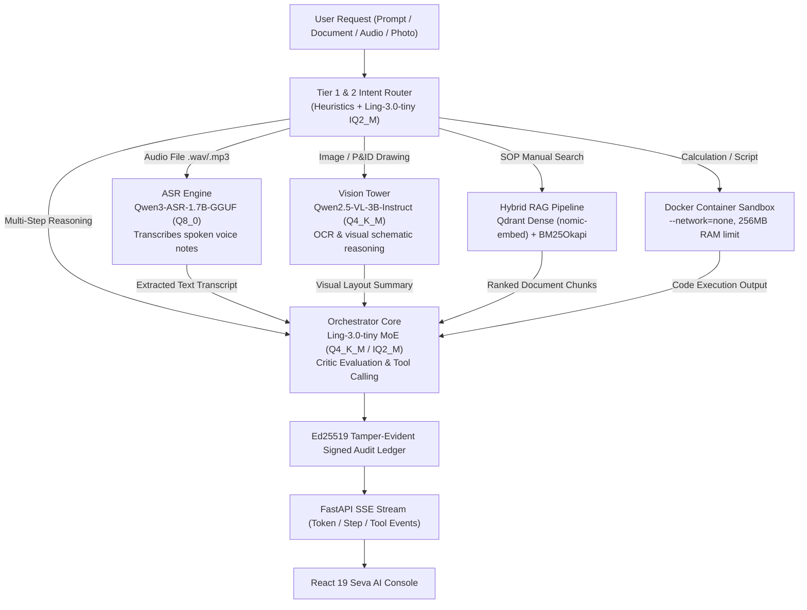

# Sovereign AI Workbench — Full System Blueprint, Knowledge Base & Study Guide (`brain.md`)

**Project:** Sovereign AI Workbench (Seva AI)  
**Smart India Hackathon 2026 (SIH):** Problem Statement **SIH26117**  
**Repository:** `mevarx/SIH26117`  
**Classification:** Enterprise-Grade, 100% Air-Gapped Capable, Zero-Egress Sovereign AI Platform  
**Target Environments:** Defense, Petroleum/Refinery Operations (e.g. MRPL), Critical National Infrastructure, Intelligence & Regulated Enterprise  
**Primary Invariant:** **Zero cloud data leakage.** All models, vector databases, sandboxes, and verification layers execute 100% on premises on local hardware.  

---

## 1. Executive Summary & Problem Context

### The Challenge (SIH26117)
Critical industrial facilities and defense infrastructure operate under strict air-gap and data classification mandates:
1. **Manual Inspection Fatigue:** Thousands of scanned inspection reports, engineering drawings, and equipment logs must be checked manually.
2. **Complex SOP Cross-Checks:** Standard Operating Procedures (SOPs), safety rules, and procurement protocols are difficult to cross-reference rapidly under operational pressure.
3. **Unreadable Scanned Artifacts:** Scanned P&ID schematics, corrosion logs, and paper forms are typically invisible to standard cloud-dependent OCR and LLMs.
4. **Unverifiable Calculations:** Engineering calculations need programmatic, sandboxed verification to avoid human or hallucination error.
5. **Absolute Prohibition of Cloud AI:** Proprietary telemetry, sensitive operational metrics, and defense secrets cannot be sent to commercial cloud AI APIs (OpenAI, Anthropic, Google Cloud) without severe national security and corporate risks.

### The Solution: Sovereign AI Workbench
A self-hosted, modular intelligence platform that operates completely isolated inside the facility's physical perimeter:
- **Zero Outbound Telemetry:** Enforced egress blocking with automated loopback auditors.
- **Multi-Model Local Squad:** Decoupled specialist models right-sized for reasoning, vision, audio, routing, and coding rather than one bloated general model.
- **Hybrid Dense + Sparse RAG:** Qdrant vector search combined with BM25 keyword matching via Reciprocal Rank Fusion (RRF) for 100% offline retrieval.
- **Container Jail Sandbox:** Temporary Docker / Bubblewrap containers executing Python/Bash code with `--network=none` and strict RAM bounds.
- **Cryptographic Auditability:** Every prompt, tool invocation, and model answer is canonically hashed with SHA-256 and digitally signed with asymmetric Ed25519 cryptography into an append-only JSONL ledger.

---

## 2. Complete Technology Stack Matrix

| Layer | Component / Tool | Version / Spec | Purpose & Architectural Role |
| :--- | :--- | :--- | :--- |
| **Backend Core** | **Python** | 3.10 – 3.13 | Core runtime environment |
| **API Framework** | **FastAPI** | `0.115.8` | High-performance async REST & Server-Sent Events (SSE) server |
| **ASGI Server** | **Uvicorn** | `0.34.0` (standard) | Production ASGI web server running on loopback `127.0.0.1:8000` |
| **Data Validation** | **Pydantic & Settings** | `2.10.6` / `2.7.1` | Strict runtime typing, bounded DTOs, and dynamic environment resolution |
| **HTTP & Pooling** | **HTTPX** | `0.28.1` | Async connection-pooled HTTP client for local model backends |
| **Orchestrator LLM** | **Ling-3.0-tiny GGUF** | MoE (7.9B / 1.3B act.) | Primary reasoning, agent tool dispatch, and RAG synthesis on CPU/GPU |
| **Vision Model** | **Qwen2.5-VL-3B** | 3B Vision-Language | Document inspection, P&ID schematic understanding, OCR pre-pass |
| **Audio Model (ASR)**| **Qwen3-ASR-1.7B** | 1.7B Audio Engine | Transcribes field voice notes, maintenance logs (`.wav`, `.mp3`, etc.) |
| **Router Model** | **Ling-3.0-tiny (IQ2_M)**| 2-bit Quantized | Sub-second zero-shot intent routing before dispatching heavy workflows |
| **Fallback Core** | **Ornith-1.5-9B** | 8.95B Dense LLM | Self-scaffolding reasoning and code synthesis fallback |
| **Serving Backends** | **Ollama / MLX / vLLM** | Multi-backend | Flexible execution across CPU laptops, Apple Silicon, or NVIDIA GPUs |
| **Vector Database** | **Qdrant** | `1.13.2` client | On-prem vector store (`localhost:6333`, Cosine metric, 768-dim) |
| **Embeddings** | **nomic-embed-text** | 768 dimensions | Local embedding generator for dense document retrieval |
| **Sparse Retrieval** | **rank-bm25** | `0.2.2` (BM25Okapi) | Term-frequency keyword retrieval combined via RRF ($k=60$) |
| **Document Parsing** | **PyMuPDF & python-docx**| `1.25.3` / `1.1.2` | Fast PDF text rendering, metadata extraction, and Word doc parser |
| **Local OCR** | **pytesseract & Pillow** | `0.3.13` / `11.1.0` | Offline optical character recognition for scanned paper and schematics |
| **Sandbox Execution**| **Docker / Bubblewrap** | CLI container jail | Isolated code execution (`--network=none`, `--memory=256m`, no swap) |
| **Security & Ledger**| **cryptography** | `>=42.0.0` (Ed25519) | Asymmetric digital signature audit logging (`data/audit.jsonl`) |
| **Frontend Core** | **React** | `19.0.0` | Component-based UI with declarative DOM lifecycle |
| **Language** | **TypeScript** | `5.7.3` (Strict) | End-to-end type safety with shared backend task schemas |
| **Build & Dev Tool**| **Vite** | `6.4.3` | Ultra-fast HMR and optimized production bundling |
| **Styling** | **TailwindCSS v4 & CSS** | `4.3.3` | Native design tokens, glassmorphism, high-contrast dark theme |
| **SSE Streaming** | **@microsoft/fetch-event-source** | `2.0.1` | Line-buffered SSE stream listener with auto-reconnection |
| **Virtualization** | **react-virtuoso** | `4.18.12` | Viewport virtualized rendering for long conversation histories |
| **Markdown / Code** | **react-markdown + highlight.js** | `10.1.0` / `11.12.0` | Render markdown, tables, mathematical equations, and syntax code |
| **Icons & UI** | **lucide-react & motion** | `1.16.0` / `13.2.0` | Accessible vector icons and hardware-accelerated animations |

---

## 3. Specialized Multi-Model Architecture & Roles

Instead of relying on a monolithic 70B parameter model that requires massive datacenter infrastructure, the Sovereign AI Workbench deploys a **specialized squad of right-sized local models**, each configured in [`configs/models.yaml`](file:///d:/CODING/SIH26117/configs/models.yaml):



### 3.1 Role Breakdown:
1. **Orchestrator (`orchestrator`):**
   - **Target Model:** `bloomer010/Ling-3.0-tiny-GGUF`
   - **Quantization:** `Q4_K_M` (~4.8 GB), auto-fallback to `IQ2_M` (~2.7 GB)
   - **Context Window:** 131,072 tokens
   - **Architecture:** Sparse Mixture of Experts (MoE) — 7.9B total parameters with only 1.3B parameters activated per token. Runs at high tokens-per-second even on low-spec CPUs.
   - **Duties:** Autonomous tool dispatch, multi-step agent reasoning loop, Critic verification, RAG answer synthesis.

2. **Computer Vision (`vision`):**
   - **Target Model:** `unsloth/Qwen2.5-VL-3B-Instruct-GGUF`
   - **Quantization:** `Q4_K_M`
   - **Context Window:** 32,768 tokens
   - **Duties:** Inspects P&ID diagrams, scanned inspection sheets, equipment corrosion photos, and layout structure. In non-vision tasks, acts as a visual descriptor, passing textual descriptions to Ling so Ling never needs to load heavy vision weights.

3. **Audio Speech Recognition (`asr`):**
   - **Target Model:** `ggml-org/Qwen3-ASR-1.7B-GGUF`
   - **Quantization:** `Q8_0`
   - **Context Window:** 8,192 tokens
   - **Supported Formats:** `.wav`, `.mp3`, `.m4a`, `.ogg`, `.flac`, `.aac`, `.webm`, `.wma`
   - **Duties:** Transcribes voice notes from maintenance engineers in refinery plant units into structured text before passing to the reasoning pipeline.

4. **Intent Router (`router`):**
   - **Target Model:** `bloomer010/Ling-3.0-tiny-GGUF`
   - **Quantization:** `IQ2_M` (aggressive 2-bit quantization)
   - **Context Window:** 131,072 tokens
   - **Duties:** Fast zero-shot intent classifier deciding whether a query needs RAG, Sandbox, Vision, Audio, Agent, or direct generation in <400ms.

5. **Reasoning & Code Fallback (`orchestrator_fallback`):**
   - **Target Model:** `ornith-ai/Ornith-1.5-9B`
   - **Quantization:** `Q4_K_M` (~5.8 GB)
   - **Context Window:** 262,144 tokens
   - **Duties:** High-capacity 8.95B dense model enabled via toggle (`use_legacy_orchestrator`) if deep architectural verification is required.

---

## 4. Multi-Hardware Serving Matrix

The workbench adapts to the user's available hardware with zero application code changes by setting `MODEL_BACKEND` in `.env`:

| Hardware Tier | Machine Type | Backend Toggle | Native Command / Server | Port | Primary Engine |
| :--- | :--- | :--- | :--- | :--- | :--- |
| **CPU / Budget Laptop** | Windows/Linux Laptop (No GPU) | `ollama` | `ollama run hf.co/bloomer010/Ling-3.0-tiny-GGUF:Q4_K_M` | `11434` | Ling-3.0-tiny MoE (Q4_K_M) |
| **Apple Silicon** | MacBook Air/Pro (M1/M2/M3/M4) | `mlx` | `python -m mlx_lm.server --model ornith-ai/Ornith-1.5-9B-MLX` | `1234` | Ornith-1.5-9B MLX |
| **Dedicated GPU Server** | On-Prem Server (NVIDIA RTX/A100) | `vllm` | `vllm serve ornith-ai/Ornith-1.5-9B --port 8000 --enable-auto-tool-choice` | `8000` | Ornith-1.5-9B (FP16/AWQ) |

---

## 5. Deep-Dive Subsystem Blueprints

### 5.1 Hybrid Retrieval-Augmented Generation (RAG)
Located in [`apps/backend/app/rag/`](file:///d:/CODING/SIH26117/apps/backend/app/rag/):
- **Document Ingestion:** Async parser supporting PDF, DOCX, and TXT files. Chunks documents into 512-token segments with 64-token sliding window overlap.
- **Dense Vector Retrieval:** Uses `nomic-embed-text` to generate 768-dimensional embeddings stored in a local Qdrant collection (`sovereign_knowledge_base`).
- **Sparse Keyword Retrieval:** Implements `rank-bm25` (BM25Okapi) for precise exact-match term lookups (e.g. equipment tag IDs like `P-101A`, refinery SOP codes).
- **Reciprocal Rank Fusion (RRF):** Merges dense and sparse rankings using standard RRF ($k=60$):
  $$RRF(d) = \sum_{m \in \{dense, sparse\}} \frac{1}{k + rank_m(d)}$$
- **Glass-Box Citation Inspector:** The frontend visualizes Cosine Similarity, BM25 score, and fused RRF scores with highlighted text snippets.

### 5.2 Isolated Container Sandbox Jail
Located in [`apps/backend/app/sandbox/`](file:///d:/CODING/SIH26117/apps/backend/app/sandbox/):
- **Zero-Network Policy:** Enforces `--network=none` flag on all ephemeral Docker containers.
- **Strict Resource Constraints:**
  - `--memory=256m` (256 MB RAM ceiling)
  - `--memory-swap=256m` (strictly disallows swapping to disk)
  - `--pids-limit=64` (prevents fork bombs)
  - `--read-only` root filesystem with transient `/tmp` mounted in memory
  - Strict 30-second execution timeout
- **Linux Bubblewrap Fallback:** If Docker is absent, attempts unprivileged Linux namespace sandboxing via `bwrap`.
- **Fail-Secure Principle:** If neither container runtime is available, all code execution fails securely with a `RuntimeError` rather than running unprotected on the host machine.

### 5.3 Cryptographic Audit Trail & Zero-Trust Posture
Located in [`apps/backend/app/security/`](file:///d:/CODING/SIH26117/apps/backend/app/security/):
- **Ed25519 Digital Signatures:** Generates an asymmetric Ed25519 keypair (`data/keys/audit_signer.pem`).
- **Append-Only JSONL Ledger:** Every action, model inference prompt, tool invocation, and system response is canonicalized (`sort_keys=True`), hashed via SHA-256, and signed.
- **Tamper Detection:** If any byte of the audit log is altered or deleted, verification functions (`verify_entry()` and `verify_log_file()`) immediately flag signature validation failure.
- **Path Jailing:** All file operations in `app/tools/file_tool.py` use `os.path.realpath()` and `os.path.commonpath()` to strictly reject symlink escapes, parent directory traversal (`../`), and null-byte injection attacks.

### 5.4 Dedicated Audio ASR Processing Pipeline
Located in [`apps/backend/app/audio/`](file:///d:/CODING/SIH26117/apps/backend/app/audio/):
- **`ASRClient` (`app/audio/asr.py`):** Communicates with `Qwen3-ASR-1.7B` via standard OpenAI-compatible audio transcription endpoints. Normalizes outputs by stripping `<asr_text>` tags and raw language indicators.
- **`AudioMiddleware` (`app/audio/middleware.py`):** Automatically scans incoming task attachments, intercepts audio files up to 50MB, executes offline transcription, and prepends structured transcripts into the prompt before passing to the orchestrator.
- **Frontend Integration (`AttachMenu.tsx`):** Users click the paperclip icon, select **Audio Note (ASR)**, upload any `.wav` or voice recording, and receive visual status badges (`ASR Transcribed`) in real time.

### 5.5 High-Performance React 19 Frontend Architecture
Located in [`apps/frontend/`](file:///d:/CODING/SIH26117/apps/frontend/):
- **`requestAnimationFrame` Token Batching (~60ms):** Eliminates browser UI freezing and token jitter by accumulating incoming SSE tokens in memory buffers and flushing them synced to the browser's 60Hz animation cycle.
- **`react-virtuoso` Virtualization:** Only DOM nodes currently visible in the viewport are rendered, allowing chats with hundreds of responses to run smoothly without memory bloat.
- **Glassmorphic Seva AI Theme:** High-contrast celestial backdrop with semi-transparent overlays, crisp typography, and responsive drawer inspectors for system health, RAG citations, and sandbox logs.

---

## 6. Directory Structure & File Map

```text
SIH26117/
├── apps/
│   ├── backend/                     # FastAPI Sovereign Backend Service
│   │   ├── app/
│   │   │   ├── agent/               # Autonomous agent orchestration & state graph
│   │   │   │   ├── events.py        # SSE event schemas
│   │   │   │   ├── graph.py         # Multi-step reasoning with Critic loop
│   │   │   │   ├── router.py        # Two-stage intent router
│   │   │   │   └── state.py         # Agent memory and conversation state
│   │   │   ├── api/                 # REST & SSE endpoints
│   │   │   │   ├── routes/          # Health, Knowledge, Security, Tasks routes
│   │   │   │   └── router.py        # Central API router
│   │   │   ├── audio/               # Dedicated Speech Recognition Module
│   │   │   │   ├── asr.py           # ASRClient (Qwen3-ASR)
│   │   │   │   └── middleware.py    # AudioMiddleware for attachment processing
│   │   │   ├── config.py            # Dynamic settings & model role resolver
│   │   │   ├── main.py              # Application entrypoint & lifespan
│   │   │   ├── models/              # Model-agnostic client abstractions
│   │   │   │   ├── base.py          # Abstract BaseModelClient
│   │   │   │   ├── local_client.py  # Universal OpenAI-compatible client
│   │   │   │   ├── registry.py      # Role-based model registry
│   │   │   │   └── vision.py        # Multimodal image compressor
│   │   │   ├── rag/                 # Retrieval-Augmented Generation
│   │   │   │   ├── embeddings.py    # nomic-embed-text wrapper
│   │   │   │   ├── ingest.py        # PDF/DOCX chunking
│   │   │   │   ├── retriever.py     # Hybrid Dense + Sparse BM25 RRF
│   │   │   │   └── vector_store.py  # Qdrant client connection
│   │   │   ├── sandbox/             # Isolated Container Sandbox
│   │   │   │   ├── docker_runner.py # Docker runner with --network=none
│   │   │   │   └── limits.py        # 256MB memory and 30s limits
│   │   │   ├── schemas/             # Pydantic v2 DTOs
│   │   │   ├── security/            # Zero-trust security & audit
│   │   │   │   ├── audit.py         # Ed25519 digital signature logger
│   │   │   │   └── network.py       # Egress network guard
│   │   │   ├── tools/               # Agent execution tools (Math, Files, Docs)
│   │   │   └── vision/              # Multimodal middleware & OCR
│   │   ├── tests/                   # 18 automated unit tests
│   │   ├── requirements.txt         # Pinned Python dependencies
│   │   └── Dockerfile               # Backend container recipe
│   └── frontend/                    # React 19 + TypeScript + Vite UI
│       ├── src/
│       │   ├── components/
│       │   │   ├── chat/            # ChatBar, ChatFeed, MessageItem, AttachMenu
│       │   │   ├── hero/            # Landing hero & smooth transitions
│       │   │   ├── layout/          # ConsoleShell, TopBar, LeftSidebar, InspectorDrawer
│       │   │   └── ui/              # Button, Popover, DropdownMenu
│       │   ├── hooks/               # useTaskStream (Throttled SSE), useDragDrop
│       │   ├── types/               # TypeScript contracts (task.ts, session.ts)
│       │   ├── App.tsx              # Root view router
│       │   └── index.css            # Dark mode tokens & styling
│       ├── package.json             # npm dependencies
│       └── vite.config.ts           # Vite bundler configuration
├── configs/
│   └── models.yaml                  # Model catalog, roles, context windows, backends
├── data/                            # Local persistent storage (gitignored)
│   ├── keys/                        # Ed25519 cryptographic keys
│   ├── uploads/                     # Uploaded files for analysis
│   └── audit.jsonl                  # Digitally signed audit trail
├── docs/                            # Formal specifications (Architecture, Security, Demo)
├── scripts/                         # Standalone operational tools
│   ├── setup.py                     # Zero-dependency bootstrap script
│   ├── health_check.py              # Multi-tier health probe
│   └── network_check.py             # Air-gap zero-egress validator
├── brain.md                         # This comprehensive master knowledge base
├── README.md                        # Quickstart onboarding guide
└── docker-compose.yml               # Multi-service container orchestration
```

---

## 7. How To Run & Operate Locally

### Prerequisites
- **Python:** `3.10` to `3.13`
- **Node.js:** `v18+` or `v20+` with `npm`
- **Ollama:** Installed and running locally (`ollama serve`)

### Step 1: Install Models in Ollama
```bash
# Orchestrator (Ling-3.0-tiny MoE)
ollama run hf.co/bloomer010/Ling-3.0-tiny-GGUF:Q4_K_M

# Vision Tower (Qwen2.5-VL-3B)
ollama pull hf.co/unsloth/Qwen2.5-VL-3B-Instruct-GGUF:Q4_K_M

# Audio Speech Recognition (Qwen3-ASR-1.7B)
ollama pull hf.co/ggml-org/Qwen3-ASR-1.7B-GGUF:Q8_0

# Embeddings (nomic-embed-text)
ollama pull nomic-embed-text
```

### Step 2: Start Backend
```bash
cd apps/backend
.\venv\Scripts\python.exe -m uvicorn app.main:app --port 8000 --reload
```
*Backend runs on `http://127.0.0.1:8000` with Swagger UI at `/docs`.*

### Step 3: Start Frontend
```bash
cd apps/frontend
npm run dev
```
*Frontend runs on `http://localhost:5173/`.*

### Step 4: Verify Air-Gap & Health
```bash
python scripts/health_check.py
python scripts/network_check.py
```

---

## 8. Summary of Architectural Decisions & Guidelines

1. **Role Decoupling Over Monolithic LLMs:** Always route vision to `Qwen2.5-VL-3B`, audio to `Qwen3-ASR-1.7B`, and reasoning to `Ling-3.0-tiny`. Never load heavy multimodal weights into the orchestrator.
2. **Deterministic Pre-Routing:** Always use heuristics and 2-bit quantization for intent routing to prevent unnecessary inference overhead.
3. **Fail-Secure Container Jails:** Never execute untrusted code directly on host OS. Default to `--network=none` Docker containers.
4. **Permanent ChatBox Availability:** The console chat composer (`ChatBar`) and attachment menu (`AttachMenu`) must remain always visible and active for instant document and voice note uploads.
5. **Zero Outbound Calls:** Never introduce cloud API dependencies or remote telemetry into any backend or frontend module.
