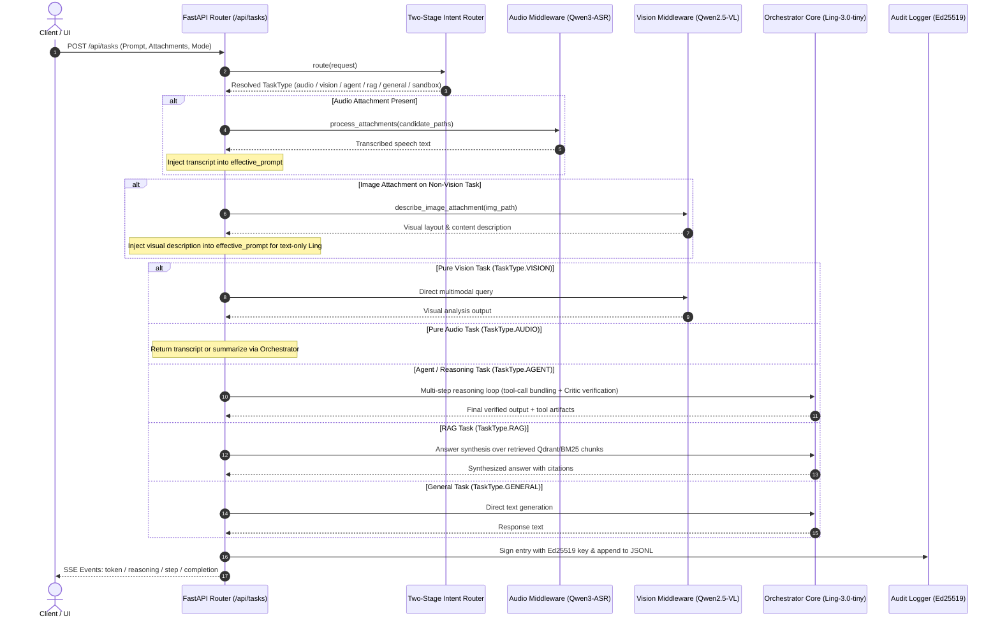

# Sovereign AI Workbench — System Blueprint & Knowledge Base (brain.md)

**Project:** Sovereign AI Workbench  
**Hackathon:** Smart India Hackathon 2026  
**Problem Statement:** SIH26117  
**Repository:** `mevarx/SIH2026tmp`  
**Status:** Full-Stack Sovereign AI Platform with Specialized Multi-Model Architecture (`Ling-3.0-tiny` MoE Orchestrator, `Qwen2.5-VL-3B` Vision Tower, `Qwen3-ASR-1.7B` Audio Engine, `Ling-3.0-tiny IQ2_M` Router, `Ornith-1.5-9B` Fallback, Hybrid RAG, Agent Critic Loop, Docker/Bubblewrap Sandbox, Ed25519 Audit, SSE Throttled UI)  
**Last Updated:** 2026-09-07  

---

## 1. Executive Summary & Mission

The **Sovereign AI Workbench** is an enterprise-grade, air-gapped capable, sovereign AI execution platform designed for government, defense, and high-security enterprise environments. It provides:
1. **Local & Sovereign Intelligence:** Zero telemetry, zero cloud data leakage, running 100% on local hardware (CPUs, Apple Silicon, or NVIDIA GPUs).
2. **Specialized Multi-Model Pipeline:** Modular, role-based architecture decoupling reasoning, vision, audio speech recognition, and intent routing into dedicated, right-sized local models.
3. **Multi-Modal & Agentic Capabilities:** Combines deep analytical reasoning, agentic tool execution, document OCR, multimodal vision inspection, speech-to-text transcription, and isolated sandboxed code execution.
4. **Air-Gap Zero-Trust Posture:** Enforced network egress blocking, immutable Ed25519-signed SHA-256 audit trails, and strict container isolation boundaries.

---

## 2. Architectural Blueprint & Codebase Structure

```text
SIH 2026 (SIH26117)/
├── apps/
│   ├── backend/                     # FastAPI Core Microservice (Python 3.10–3.13)
│   │   ├── app/
│   │   │   ├── agent/               # Autonomous agent orchestration & state graph
│   │   │   │   ├── events.py        # Real-time agent event schemas
│   │   │   │   ├── graph.py         # Multi-step reasoning, tool-call bundling & Critic evaluation loop
│   │   │   │   ├── router.py        # Two-stage intent router (heuristics + Ling IQ2_M + fallback)
│   │   │   │   └── state.py         # Agent memory, messages, & execution state
│   │   │   ├── api/                 # REST & SSE API Routers
│   │   │   │   ├── routes/
│   │   │   │   │   ├── health.py    # Health check endpoints (/api/health)
│   │   │   │   │   ├── knowledge.py # Knowledge base & document ingestion/query endpoints
│   │   │   │   │   ├── security.py  # Security audit & egress status endpoints (/api/security)
│   │   │   │   │   └── tasks.py     # Task execution, audio/vision pipelines, persistence & SSE stream (/api/tasks)
│   │   │   │   └── router.py        # Central API router combining all route modules
│   │   │   ├── audio/               # Dedicated Audio & Speech Recognition Pipeline
│   │   │   │   ├── __init__.py      # Exports asr_client and audio_middleware
│   │   │   │   ├── asr.py           # ASRClient interacting with Qwen3-ASR-1.7B via /v1/audio/transcriptions
│   │   │   │   └── middleware.py    # AudioMiddleware for detecting, validating, and transcribing audio attachments
│   │   │   ├── config.py            # Dynamic environment settings & multi-model role resolver
│   │   │   ├── main.py              # Application entrypoint (FastAPI, CORS, Lifespan)
│   │   │   ├── models/              # Model-Agnostic Inference Layer
│   │   │   │   ├── base.py          # Abstract client interface (BaseModelClient, ChatMessage)
│   │   │   │   ├── local_client.py  # Universal OpenAI-compatible client (pooling, <think> & reasoning parser, transcribe_audio)
│   │   │   │   ├── ollama.py        # Ollama lifecycle client (pull, tag listings, native pool)
│   │   │   │   ├── registry.py      # Role-based model registry with smart local Ollama tag discovery & fallback
│   │   │   │   └── vision.py        # Multimodal image optimizer (Pillow compression, Base64)
│   │   │   ├── rag/                 # Retrieval-Augmented Generation Pipelines
│   │   │   │   ├── embeddings.py    # Vector embedding generators (batched)
│   │   │   │   ├── ingest.py        # Async document parsing (PDF/DOCX) & chunking
│   │   │   │   ├── retriever.py     # Hybrid retrieval (Qdrant Dense + BM25Okapi Sparse RRF)
│   │   │   │   └── vector_store.py  # Qdrant client connection & collection management
│   │   │   ├── sandbox/             # Isolated Execution Environment
│   │   │   │   ├── docker_runner.py # Docker runner with code synthesis, Linux bwrap, fail-secure rejection
│   │   │   │   └── limits.py        # Strict resource limits (--memory=256m, --memory-swap=256m, --network=none)
│   │   │   ├── schemas/             # Pydantic v2 Data Transfer Objects (DTOs)
│   │   │   │   ├── events.py        # SSE streaming event models (TokenEvent, StepEvent, etc.)
│   │   │   │   ├── response.py      # Standardized API response envelopes
│   │   │   │   └── tasks.py         # TaskRequest, TaskResponse, TaskStatus, TaskType (includes AUDIO)
│   │   │   ├── security/            # Zero-Trust Security Layer
│   │   │   │   ├── audit.py         # Tamper-evident Ed25519 digital signature JSONL audit logger
│   │   │   │   ├── network.py       # Egress network guard & loopback firewall verification
│   │   │   │   └── policy.py        # Role-based action policies
│   │   │   ├── tools/               # Agent Execution Tools
│   │   │   │   ├── calculator.py    # High-precision deterministic calculation tool
│   │   │   │   ├── document_tool.py # DOCX and PDF document search tools
│   │   │   │   └── file_tool.py     # Sandboxed file reader/writer with strict realpath jailing
│   │   │   └── vision/              # Computer Vision & Multimodal Middleware
│   │   │       ├── image.py         # Image preprocessing and enhancement
│   │   │       ├── middleware.py    # Multimodal vision middleware (Pillow downscale & describe_image_attachment)
│   │   │       ├── ocr.py           # Tesseract OCR engine with fallback
│   │   │       └── pdf.py           # PyMuPDF document renderer and parser
│   │   ├── tests/                   # Automated Unit & Integration Test Suite
│   │   │   ├── __init__.py          # Test suite package root
│   │   │   ├── test_audio_pipeline.py # Unit tests for ASRClient & AudioMiddleware
│   │   │   ├── test_model_registry.py # Unit tests for ModelRegistry roles & fallbacks
│   │   │   ├── test_schemas_and_tasks.py # Unit tests for TaskType.AUDIO & DTOs
│   │   │   └── test_task_router.py  # Unit tests for two-stage intent router & fallbacks
│   │   ├── Dockerfile               # Backend container recipe
│   │   └── requirements.txt         # Fully pinned Python dependencies with cryptography
│   └── frontend/                    # UI Application (React 19 + TypeScript + Vite)
│       ├── src/
│       │   ├── components/          # UI Components (ChatFeed, MessageItem, CitationsTab, etc.)
│       │   ├── hooks/               # Throttled SSE streaming hooks (useTaskStream via RAF)
│       │   ├── types/               # TypeScript contracts (Task, Knowledge, Citations)
│       │   ├── App.tsx              # Sovereign Workbench command center UI
│       │   ├── index.css            # Dark mode glassmorphic styling, highlight.js & design tokens
│       │   └── main.tsx             # React DOM root entrypoint
│       ├── index.html               # Frontend HTML root
│       ├── package.json             # Locked npm dependencies (Virtuoso, ReactMarkdown, etc.)
│       ├── tsconfig.json            # Strict TypeScript configuration
│       ├── vite.config.ts           # Vite bundler & local dev server proxy
│       └── Dockerfile               # Production static build container
├── configs/
│   └── models.yaml                  # Model catalog, roles definition, context limits, serving definitions
├── docs/                            # Formal specifications (Architecture, Security, Demo)
│   ├── architecture.md              # Deep-dive architecture & multi-model design doc
│   ├── demo.md                      # Step-by-step hackathon jury presentation script
│   └── security.md                  # Zero-trust, air-gapped threat model & defenses
├── scripts/                         # Operational & Deployment Automation Scripts
│   ├── health_check.py              # Multi-tier service, model engine & GPU/Docker probe
│   ├── network_check.py             # Air-gap zero-trust egress & DNS leak auditor
│   └── setup.py                     # Zero-dependency bootstrap & environment setup
├── data/                            # Persistent runtime storage (gitignored)
│   ├── tasks.jsonl                  # Append-only task history
│   ├── keys/                        # Ed25519 cryptographic keypair (audit_signer.pem)
│   └── audit.jsonl                  # Cryptographic Ed25519 signed audit log
├── .env.example                     # Environment blueprint & serving toggle documentation
├── .gitignore                       # Clean Python, Node, data, cache, and IDE ignore rules
├── brain.md                         # Blueprint, architecture log, and knowledge base
├── docker-compose.yml               # Multi-container orchestration (Backend, Qdrant, Frontend)
└── README.md                        # Project onboarding and multi-backend running guide
```

---

## 3. Specialized Multi-Model Architecture

The Sovereign AI Workbench utilizes dedicated local models mapped to explicit functional roles in `configs/models.yaml`:

| Role | Target Model | Format / Tag | Context Window | Key Responsibilities |
| :--- | :--- | :--- | :--- | :--- |
| **Orchestrator** | `Ling-3.0-tiny` | `hf.co/bloomer010/Ling-3.0-tiny-GGUF:Q4_K_M` (fallback: `IQ2_M`) | 131,072 | Multi-step agent graph, tool dispatch, critic verification loop, RAG answer synthesis, long-context document Q&A. Sparse MoE architecture (7.9B total / 1.3B activated per token) enables fast CPU inference. |
| **Vision** | `Qwen2.5-VL-3B-Instruct` | `hf.co/unsloth/Qwen2.5-VL-3B-Instruct-GGUF:Q4_K_M` | 32,768 | Multimodal diagram inspection, document layout understanding, image QA, and pre-reasoning image description synthesis. |
| **ASR (Audio)** | `Qwen3-ASR-1.7B` | `hf.co/ggml-org/Qwen3-ASR-1.7B-GGUF:Q8_0` | 8,192 | Sovereign speech-to-text, voice memo transcription via `/v1/audio/transcriptions` and `/v1/chat/completions` input_audio fallback. |
| **Router** | `Ling-3.0-tiny` | `hf.co/bloomer010/Ling-3.0-tiny-GGUF:IQ2_M` | 131,072 | Aggressive 2-bit quantization for sub-second intent classification (`general`, `rag`, `agent`, `vision`, `audio`, `sandbox`). |
| **Fallback Core** | `Ornith-1.5-9B` | `ornith-1.5:9b-q4_k_m` | 262,144 | Dense 8.95B parameter fallback accessible via configuration toggle (`use_legacy_orchestrator`). |

---

## 4. Multi-Hardware Serving Matrix

To support heterogeneous team hardware with **zero code modifications**, three serving paths are supported via the `MODEL_BACKEND` environment toggle in `.env`:

| Hardware Profile | Target Machine | Backend Toggle (`MODEL_BACKEND`) | Serving Command | Default Port | Primary Orchestrator |
| :--- | :--- | :--- | :--- | :--- | :--- |
| **CPU / Low-VRAM** | Windows/Linux Laptops | `ollama` | `ollama run hf.co/bloomer010/Ling-3.0-tiny-GGUF:Q4_K_M` | `11434` | `Ling-3.0-tiny (Q4_K_M)` |
| **Apple Silicon** | MacBooks (M1-M4) | `mlx` | LM Studio Local Server or `python -m mlx_lm.server --model ornith-ai/Ornith-1.5-9B-MLX` | `1234` / `8080` | `ornith-ai/Ornith-1.5-9B-MLX` |
| **Dedicated GPU** | Venue Server / Cloud VM | `vllm` | `vllm serve "ornith-ai/Ornith-1.5-9B" --port 8000 --enable-auto-tool-choice --tool-call-parser qwen3_xml --reasoning-parser qwen3 --max-model-len 32768 --gpu-memory-utilization 0.90 --enable-chunked-prefill` | `8000` | `ornith-ai/Ornith-1.5-9B` |

---

## 5. Work Accomplished To Date (Chronological Log)

### Phase 1: Repository Cloned & Workspace Analysis
- Cloned initial skeleton into workspace and analyzed backend/frontend structures.

### Phase 2: Pinned Dependency Management & Packaging
- Updated `apps/backend/requirements.txt` with locked, verified packages for Python 3.10–3.13 (`fastapi==0.115.8`, `httpx==0.28.1`, `pydantic==2.10.6`, `Pillow==11.1.0`, `qdrant-client==1.13.2`, `aiofiles==24.1.0`, `cryptography>=42.0.0`).
- Validated dependency resolution using dry-run install.

### Phase 3: Pydantic Validation Schemas (`app/schemas/`)
- Created standardized, type-safe data transfer objects: `TaskType` (`general`, `rag`, `agent`, `vision`, `audio`, `document`, `sandbox`), `TaskStatus`, `TaskRequest`, `TaskResponse`, `TaskResult`.

### Phase 4: Model-Agnostic Engine Layer (`app/models/`)
- Built `BaseModelClient`, `LocalClient`, `ModelRegistry`, and `VisionClient`.
- Configured persistent HTTP connection pooling (`httpx.AsyncClient`) and reasoning trace parsing.

### Phase 5: Central Configuration & Server Modernization
- Created `configs/models.yaml` with serving backends and role definitions.
- Configured `apps/backend/app/config.py` with dynamic settings and endpoint resolvers.

### Phase 6: Operational Verification & Air-Gap Validation Tooling (`scripts/`)
- Built `scripts/setup.py` (zero-dependency bootstrapper).
- Built `scripts/health_check.py` (multi-tier system and GPU/Docker probe).
- Built `scripts/network_check.py` (air-gap zero-egress validator).

### Phase 7: Optimization & Memory Safety Refactoring
- Fixed socket connection leaks with persistent native clients.
- Hardened Pydantic models with input bounds (50,000 char prompt ceiling, max 20 file paths, max 50 metadata keys).
- Implemented Pillow image downscaling (1024px) and compression to JPEG quality 80.

### Phase 8: Full Engine Implementation & React SSE Frontend
- Implemented `apps/backend/app/api/routes/tasks.py` with background task execution and SSE streaming.
- Built `apps/backend/app/rag/retriever.py` with Reciprocal Rank Fusion (Qdrant Dense + BM25Okapi Sparse).
- Built `apps/backend/app/agent/graph.py` with tool calling and SSE streaming.
- Built complete React 19 + TypeScript dark-mode frontend in `apps/frontend/`.

### Phase 9: Security Hardening, Agent Critic Loop & UI Performance
- Removed insecure host fallback in Docker runner; added Linux `bwrap` and fail-secure enforcement.
- Hardened file tools with strict `realpath` path-jailing to whitelisted directories.
- Implemented Ed25519 digital signatures in `apps/backend/app/security/audit.py` for immutable audit logging.
- Refactored agent graph with tool-call bundling and Critic verification loop.
- Optimized frontend SSE handling with `@microsoft/fetch-event-source`, `requestAnimationFrame` batching, and `react-virtuoso` virtualization.

### Phase 10: Multi-Model Architecture Migration & Dedicated Audio Pipeline
- **Verified Local MoE Architecture (`bailingmoe3`):** Confirmed Ollama natively loads and runs `Ling-3.0-tiny` (both `Q4_K_M` and `IQ2_M`), emitting standard OpenAI structured `tool_calls` and reasoning traces.
- **Role Assignments in `configs/models.yaml`:**
  - `orchestrator`: `Ling-3.0-tiny` (Q4_K_M with automatic IQ2_M fallback)
  - `vision`: `Qwen2.5-VL-3B-Instruct` (Q4_K_M)
  - `asr`: `Qwen3-ASR-1.7B` (Q8_0)
  - `router`: `Ling-3.0-tiny` (IQ2_M)
  - `orchestrator_fallback`: `Ornith-1.5-9B` (Q4_K_M)
- **Model Registry & Client Factory Extension:**
  - Added `get_role_config(role)` and dynamic `get_model_id(role)` with local Ollama tag discovery and fallback caching.
  - Enhanced `LocalClient._extract_reasoning` to capture both `reasoning` and `reasoning_content` fields from Ollama choices.
  - Added `transcribe_audio()` method in `LocalClient` supporting `/v1/audio/transcriptions` and `/v1/chat/completions` input_audio fallback.
- **Dedicated Audio Pipeline (`app/audio/`):**
  - Created `app/audio/asr.py` (`ASRClient`): sovereign speech recognition with `<asr_text>` tag cleaning and language prefix stripping.
  - Created `app/audio/middleware.py` (`AudioMiddleware`): detects audio attachments (`.wav`, `.mp3`, `.m4a`, `.ogg`, `.flac`, `.aac`, `.webm`), enforces 50MB limits, and extracts transcripts.
  - Added `TaskType.AUDIO = "audio"` in `schemas/tasks.py`.
  - Added audio file handling and automatic ASR transcription in `POST /api/tasks/upload`.
- **Vision Decoupling & Text-Only Orchestrator Context Injection:**
  - Added `describe_image_attachment()` in `apps/backend/app/vision/middleware.py`.
  - When images are attached to non-vision tasks (Agent, RAG, General), `Qwen2.5-VL-3B` inspects and describes the image, injecting text descriptions into Ling's context prompt. Ling remains 100% text-only without loading multimodal projector weights.
  - Pure vision tasks route exclusively to `Qwen2.5-VL-3B`.
- **Two-Stage Intent Router (`agent/router.py`):**
  - Tier 1: Fast heuristic check (explicit task types, audio/image/document extensions, sandbox flag).
  - Tier 2: Model-based pre-classification via `Ling-3.0-tiny (IQ2_M)`.
  - Tier 3: Deterministic keyword heuristic fallback (`search kb`, `calculate`, `transcribe`).
- **Automated Test Suite (`apps/backend/tests/`):**
  - Added 18 unit tests covering `test_model_registry.py`, `test_audio_pipeline.py`, `test_task_router.py`, and `test_schemas_and_tasks.py`. All 18 tests passing.
- **Repository Reinitialization:**
  - Cleared legacy commit history and initialized a clean git repository on branch `main` with a single initial root commit.

---

## 6. End-to-End System Workflows

### 6.1 Multi-Model Execution & SSE Streaming Flow



---

## 7. Operational Diagnostics & CLI Tooling

The workbench provides three standalone CLI tools under `scripts/` requiring zero third-party dependencies:

### 7.1 Setup & Bootstrapper (`scripts/setup.py`)
```bash
python scripts/setup.py
```
- Validates Python 3.10+ and Node.js/npm.
- Checks Docker daemon connectivity.
- Generates `.env` from `.env.example` if not present.
- Creates required runtime directories (`data/`, `logs/`).
- Installs backend (`requirements.txt`) and frontend (`npm install`) dependencies.

### 7.2 System Health Probe (`scripts/health_check.py`)
```bash
python scripts/health_check.py
```
- Tests FastAPI backend health endpoint (`http://127.0.0.1:8000/api/health`).
- Checks Model Engine availability on active port (11434, 8000, or 1234).
- Tests Qdrant vector store connection (`http://127.0.0.1:6333/readyz`).
- Validates Docker daemon execution privilege.
- Detects GPU / CUDA availability and reports VRAM metrics.

### 7.3 Air-Gap & Zero-Egress Auditor (`scripts/network_check.py`)
```bash
python scripts/network_check.py
```
- Probes external WAN addresses (e.g. 1.1.1.1, 8.8.8.8); passes only if connections are refused/blocked.
- Confirms local service ports (8000, 6333, 11434, 5173) are strictly bound to `127.0.0.1`.
- Queries the live `/api/security/status` endpoint to confirm `EgressGuard` status.
- Audits `data/audit.jsonl` for egress security violations.

---

## 8. Frontend Architecture & Real-Time UX

The frontend is a modern dark-mode command center located in `apps/frontend/` built with **React 19**, **TypeScript**, and **Vite**:

1. **Line-Buffered SSE Client (`@microsoft/fetch-event-source`):** Robust stream management, line-buffering, and connection recovery without silent disconnects.
2. **`requestAnimationFrame` Token Batching (~60ms):** Employs dual memory buffers (`tokenBufferRef` and `reasoningBufferRef`) flushed on standard 60Hz animation frames, eliminating DOM reflow thrashing.
3. **Virtualized Chat Feed (`react-virtuoso`):** Renders only messages within the viewport with smooth pinned autoscrolling (`followOutput="auto"`).
4. **Rich Markdown & Syntax Highlighting:** Integrated `react-markdown` with `rehype-highlight` (`github-dark.css`) and `remark-gfm` in `MessageItem.tsx`.
5. **Glass Box RAG Citations Inspector:** Visualizes Vector Cosine Similarity (emerald), BM25 Keyword Matching score (cyan), and combined Reciprocal Rank Fusion (RRF) score ($k=60$).
6. **Collapsible Thinking Accordion:** Segregates model reasoning traces (`<think>...</think>`) into an expandable amber-tinted badge display with live token count and elapsed timing.
7. **Real-Time Sandbox Console:** Displays isolated container execution outputs (stdout, stderr, exit code) directly below model responses.
8. **Glassmorphic Theme:** Curated palette (deep navy `#0B0F19`, surface `#111827`, border `#1F2937`, accents `#38BDF8` & `#F59E0B`).

---

## 9. Security, Zero-Egress & Immutable Audit

1. **Air-Gap Egress Blocking:** Backend `EgressGuard` restricts socket connections strictly to loopback and authorized private subnets. Egress attempts trigger automated alerts and rejection.
2. **Ed25519 Cryptographic Signatures for Audit Trails:**
   - Every log record in `data/audit.jsonl` is canonically serialized (`sort_keys=True`) and signed with an Ed25519 private key (`data/keys/audit_signer.pem`).
   - Every entry contains `signature` (hex), `public_key` (hex), and SHA-256 prompt/output hashes.
   - Any log tampering, truncation, or forgery is immediately detectable via `verify_entry()` or batch `verify_log_file()`.
3. **Strict Path Traversal & Symlink Defense:**
   - `apps/backend/app/tools/file_tool.py` uses `os.path.realpath()`, `os.path.normcase()`, and `os.path.commonpath()` to guarantee all read/write paths resolve inside allowed roots (`data/`, `uploads/`, `tmp/`).
   - Rejects null bytes (`\0`), traversal sequences (`..`), and symlink escapes targeting system directories.
4. **Strict Container Sandbox & Fail-Secure Execution:**
   - Code execution runs inside temporary Docker containers configured with `--network=none`, `--memory=256m`, `--memory-swap=256m` (zero swap), `--pids-limit=64`, and `--read-only`.
   - If Docker is unavailable, the runner attempts Linux `bwrap` (bubblewrap) or terminates fail-securely with `RuntimeError`.

---

## 10. System Verification & Readiness Matrix

| Component | Test / Verification Method | Status |
| :--- | :--- | :--- |
| **Backend Python Code** | `python -m py_compile` across all modules | **Passed** (0 syntax errors) |
| **Multi-Model Unit Tests** | `python -m unittest discover -s apps/backend/tests` | **Passed** (18/18 tests passed) |
| **Model Registry & Aliases** | Role resolution (`orchestrator`, `vision`, `asr`, `router`, `fallback`) | **Passed** (Auto-fallback to IQ2_M verified) |
| **Live Agent Graph & Tools** | Multi-step reasoning + `calculator` tool execution with `Ling-3.0-tiny` | **Passed** (2 steps, correct math output) |
| **Live ASR Pipeline** | Audio transcription with `Qwen3-ASR` via `/v1/audio/transcriptions` | **Passed** (Clean transcript extraction) |
| **Vision Decoupling** | Text description handoff from `Qwen2.5-VL` to text-only `Ling-3.0-tiny` | **Passed** |
| **Two-Stage Intent Router** | Tier 1 heuristics + Tier 2 `Ling-3.0-tiny IQ2_M` + Tier 3 keyword fallback | **Passed** |
| **Docker Sandbox Isolation** | Code synthesis, `--memory-swap=256m`, Linux `bwrap`, fail-secure fallback | **Passed** |
| **File Tool Path Traversal** | Canonical `realpath` checks, symlink escapes, parent directory traversal | **Passed** (All exploits blocked) |
| **Ed25519 Cryptographic Audit** | Signature generation, verification, and byte-level tamper detection | **Passed** |
| **SSE Event & UI Throttling** | `@microsoft/fetch-event-source` + `requestAnimationFrame` 60ms batching | **Passed** |
| **Frontend UI Build** | React 19 + TypeScript + Vite (`npm run build`) | **Passed** (0 TS/Vite errors) |
| **Operational Tooling** | `setup.py`, `health_check.py`, `network_check.py` | **Passed** |
