# 🏭 Sovereign AI Workbench

### Problem Statement ID: **PS-26117** — SIH 2026

> **An AI-powered assistant for industrial plant operations that runs 100% offline — no data ever leaves your computer.**

---

## 📌 What Is This Project?

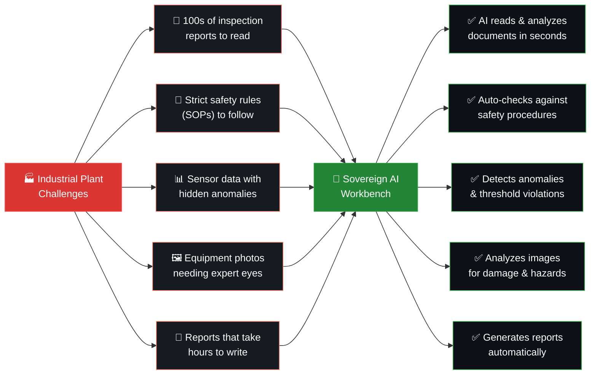

> ### 🔒 The #1 Rule: Everything stays on YOUR computer. Zero data goes to the internet.

---

## 🎯 Features At A Glance

| # | Feature | Input | Output | Agent |
|---|---------|-------|--------|-------|
| 1 | 📄 **Document Analysis** | PDF inspection report | Official approval note (.docx) | Document Agent |
| 2 | 💬 **Knowledge Q&A** | Plain English question | Answer with cited sources | Knowledge Assistant |
| 3 | 👁️ **Vision Analysis** | Photo of equipment | Damage/hazard description | Vision Agent |
| 4 | 🔧 **Maintenance Help** | Symptom description | Procedures + safety checks | Maintenance Agent |
| 5 | ⚠️ **Safety Analysis** | Situation description | PPE + emergency procedures | Safety Agent |
| 6 | 📊 **Sensor Analytics** | CSV sensor data | Anomaly detection + metrics | Analytics Agent |
| 7 | 📝 **Report Generator** | Machine + date range | Professional report | Report Agent |
| 8 | 🎤 **Voice Notes** | Audio recording | Transcribed text | Whisper Model |
| 9 | 💻 **Code Execution** | Engineering task | Python script + results | Coding Agent |
| 10 | 🛡️ **Security Monitor** | — (always active) | Live zero-egress dashboard | Security Agent |

---

## 🧠 AI Models — All Running Locally

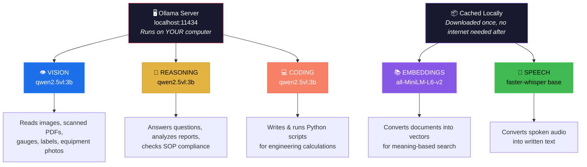

| Model | Name | Task | Runtime | Size |
|-------|------|------|---------|------|
| 👁️ Vision | `qwen2.5vl:3b` | Image + PDF understanding | Ollama (localhost) | ~2 GB |
| 🤔 Reasoning | `qwen2.5vl:3b` | Q&A, SOP checks, analysis | Ollama (localhost) | ~2 GB |
| 💻 Coding | `qwen2.5vl:3b` | Python code generation | Ollama (localhost) | ~2 GB |
| 📚 Embedding | `all-MiniLM-L6-v2` | Document similarity search | HuggingFace (cached) | ~80 MB |
| 🎤 Speech | `faster-whisper (base)` | Voice → Text | CPU (local) | ~150 MB |

---

## 🏗️ System Architecture

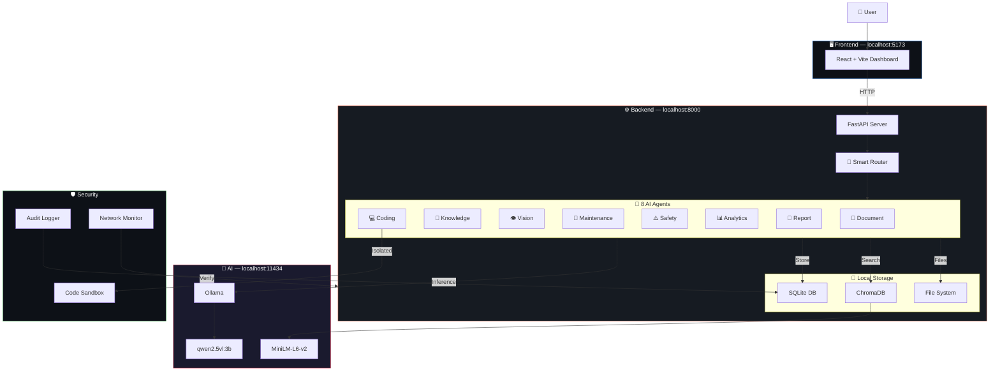

---

## 📄 Flow 1: Document Agent (Hero Demo)

> Upload a scanned inspection report → Get a professional approval note

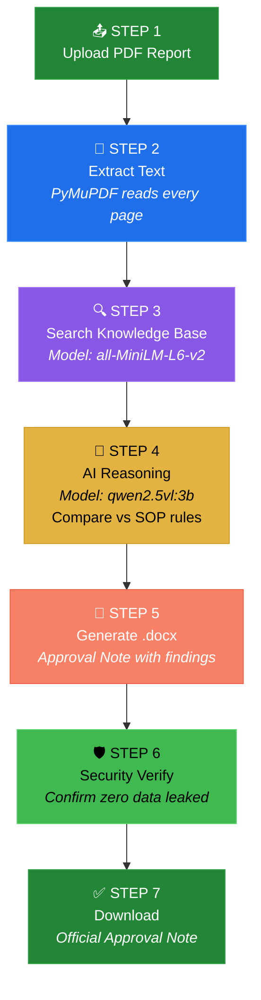

| Step | What Happens | Model/Tool Used |
|------|-------------|-----------------|
| 1 | User uploads a PDF inspection report | — |
| 2 | System reads every page and extracts all text | PyMuPDF |
| 3 | Finds matching SOPs & safety procedures by *meaning* | all-MiniLM-L6-v2 + ChromaDB |
| 4 | AI compares inspection findings vs SOP rules | qwen2.5vl:3b (Ollama) |
| 5 | Generates a professional `.docx` Approval Note | python-docx |
| 6 | Verifies no data left the local machine | Network Monitor (lsof) |
| 7 | User downloads the finished document | — |

---

## 💬 Flow 2: Knowledge Assistant

> Ask a question → Get an answer grounded in your documents (or a clear refusal)

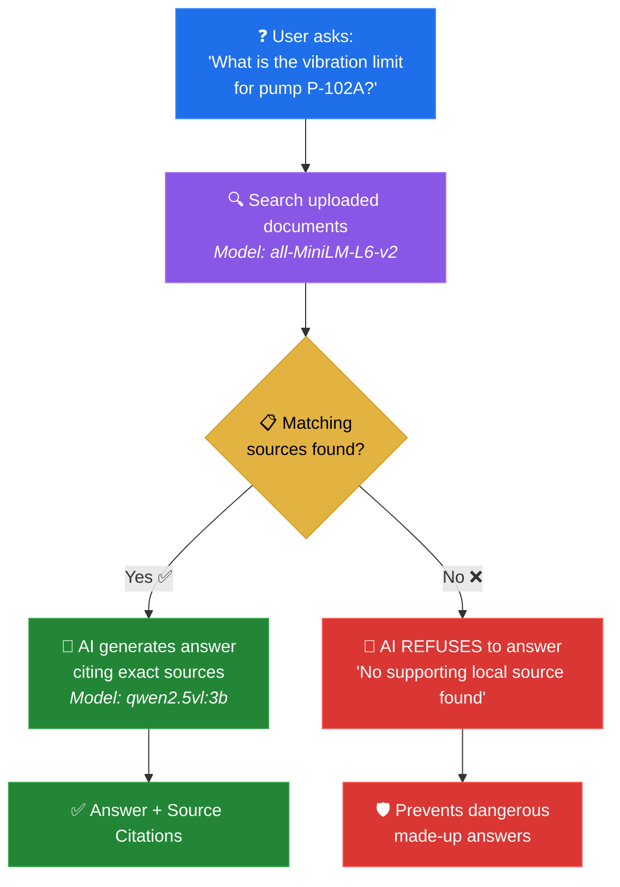

> ⚠️ **Anti-Hallucination Policy**: If the AI can't find the answer in your documents, it **refuses to guess**. Critical for safety-sensitive environments.

---

## 👁️ Flow 3: Vision Analysis

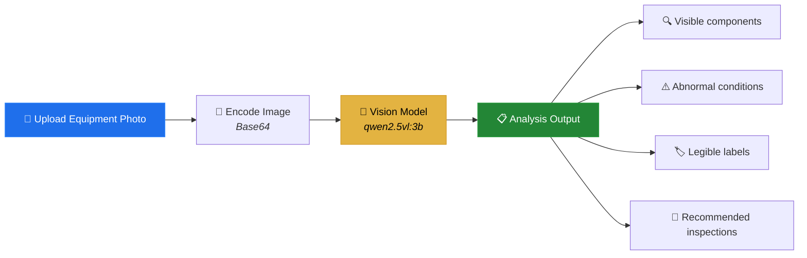

---

## 💻 Flow 4: Coding Agent (Sandboxed)

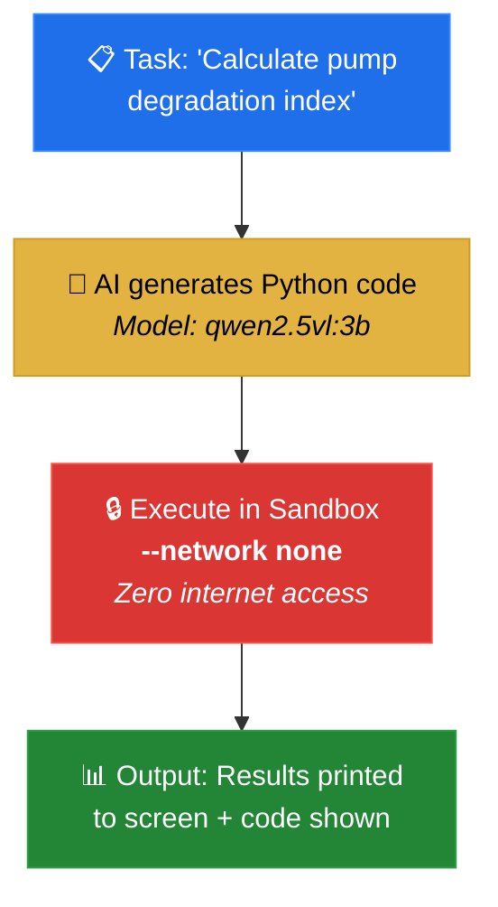

| Property | Value |
|----------|-------|
| **Network Access** | ❌ Completely blocked (`--network none`) |
| **Can code leak data?** | ❌ Impossible — no socket access |
| **Language** | Python |
| **Output** | Printed to stdout, shown to user |

---

## 🔧 Flow 5: Maintenance / Safety / Failure Agents

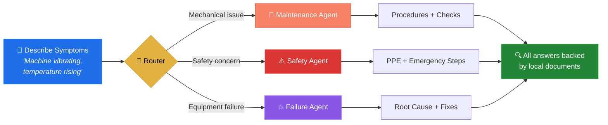

---

## 📊 Flow 6: Sensor Analytics

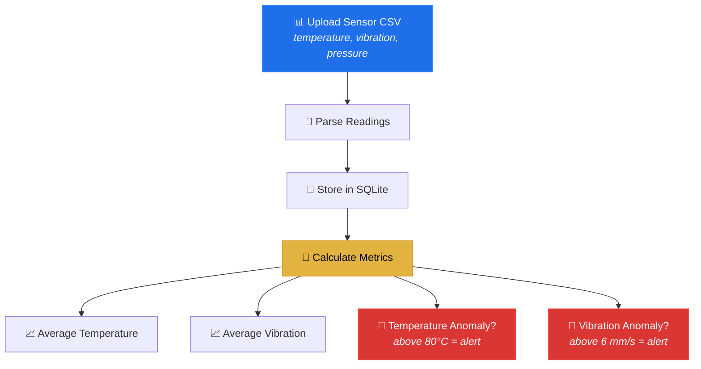

---

## 🛡️ Security Architecture

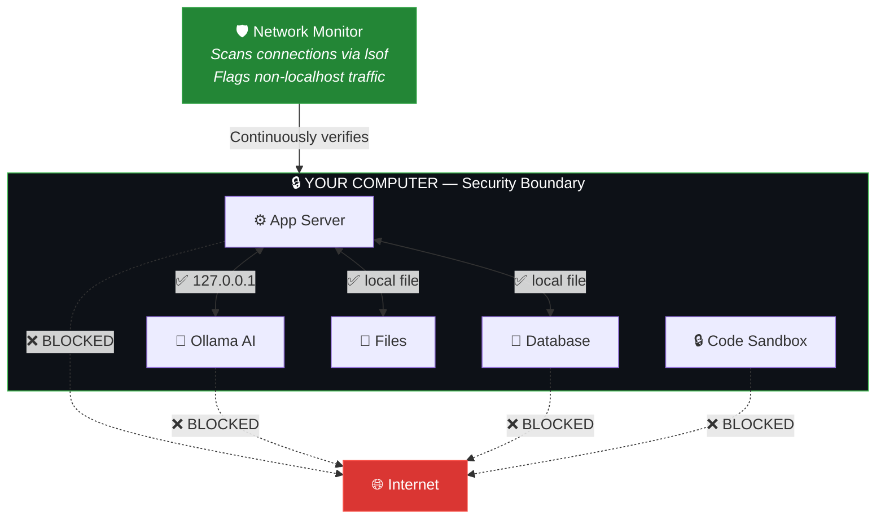

| Security Feature | Status | How |
|-----------------|--------|-----|
| AI runs locally | ✅ | Ollama on `localhost:11434` |
| Data stored locally | ✅ | SQLite + local files |
| No cloud API calls | ✅ | No OpenAI/Google/Azure imports |
| Network monitoring | ✅ | `lsof` scans active connections |
| Code sandbox isolation | ✅ | `--network none` blocks all sockets |
| Full audit trail | ✅ | Every action logged with timestamp |
| External telemetry | ❌ Blocked | No analytics sent anywhere |

---

## 🤖 Agent Routing — How Tasks Get Assigned

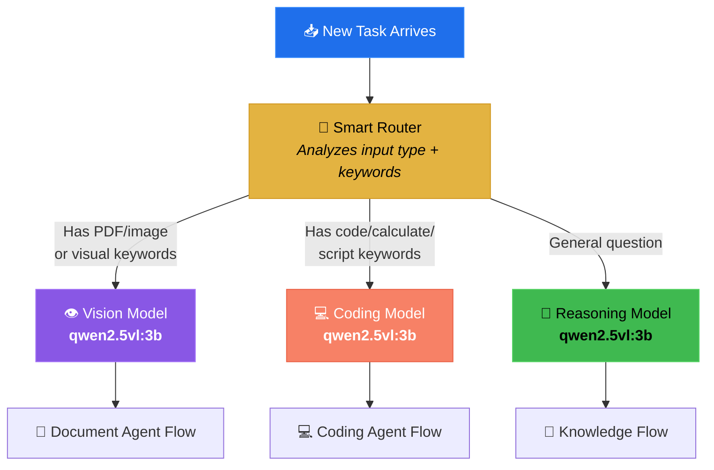

| Input Signal | Detected By | Routes To |
|-------------|------------|-----------|
| PDF, PNG, JPG file attached | File extension check | 👁️ Vision → Document Agent |
| Words: *inspection, scanned, diagram, gauge* | Regex pattern match | 👁️ Vision → Document Agent |
| Words: *code, script, python, calculate, compute* | Regex pattern match | 💻 Coding Agent |
| Everything else | Default fallback | 🤔 Knowledge Assistant |

---

## 📂 Project Structure

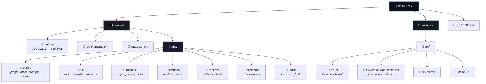

---

## 🧩 Tech Stack

| Layer | Technology | Role |
|-------|-----------|------|
| 🖥️ **Frontend** | React + Vite | Dashboard UI |
| ⚙️ **Backend** | Python FastAPI | API server |
| 💾 **Database** | SQLite | Documents, reports, audit logs |
| 🔍 **Vector DB** | ChromaDB | Semantic document search |
| 📄 **PDF Reader** | PyMuPDF | Extract text from PDFs |
| 📝 **Doc Writer** | python-docx | Generate .docx approval notes |
| 🧠 **AI Runtime** | Ollama | Local model serving |
| 👁️ **Main Model** | Qwen 2.5 VL (3B) | Vision + Language |
| 📚 **Embeddings** | all-MiniLM-L6-v2 | Document search |
| 🎤 **Speech** | faster-whisper | Voice-to-text |

---

## 🚀 Setup — 4 Steps

### Step 1: Clone

```bash
git clone https://github.com/i-shubhh/DEMO-117.git
cd DEMO-117
```

### Step 2: Start Local AI

```bash
# Install Ollama → https://ollama.com
ollama serve
ollama pull qwen2.5vl:3b       # ~2GB download, only once
```

### Step 3: Start Backend

```bash
cd backend
python3 -m venv venv
source venv/bin/activate        # Windows: venv\Scripts\activate
pip install -r requirements.txt
cp .env.example .env
uvicorn main:app --host 0.0.0.0 --port 8000 --reload
```

### Step 4: Start Frontend

```bash
cd frontend                     # new terminal
npm install
npm run dev
```

> 🎉 Open **http://localhost:5173** in your browser!

---

## ⚙️ Configuration

| Variable | Default | What It Does |
|----------|---------|-------------|
| `OLLAMA_URL` | `http://localhost:11434/api/generate` | Where the AI model runs |
| `OLLAMA_MODEL` | `qwen2.5vl:3b` | Which AI model to use |
| `SOVEREIGN_DATA_DIR` | `./data` | Where files are stored |
| `WHISPER_MODEL` | `base` | Speech-to-text model size |
| `CORS_ORIGINS` | `http://localhost:5173,...` | Allowed frontend URLs |

---

## 🔌 API Endpoints

### Core APIs

| Endpoint | Method | Description |
|----------|--------|-------------|
| `/` | GET | Server status check |
| `/health` | GET | Full system health |
| `/system/status` | GET | AI model + storage status |
| `/agents` | GET | List all 8 AI agents |
| `/audit-logs` | GET | Complete audit trail |

### Document & Knowledge APIs

| Endpoint | Method | Description |
|----------|--------|-------------|
| `/documents/upload` | POST | Upload & index a document |
| `/documents` | GET | List all documents |
| `/documents/{id}` | GET | Get document details |
| `/documents/{id}/file` | GET | Download original file |
| `/chat` | POST | Ask the Knowledge Assistant |
| `/knowledge` | GET | Knowledge base stats |

### Analysis APIs

| Endpoint | Method | Description |
|----------|--------|-------------|
| `/vision/analyze` | POST | Analyze equipment photo |
| `/maintenance/analyze` | POST | Maintenance recommendations |
| `/safety/analyze` | POST | Safety & PPE analysis |
| `/failure/analyze` | POST | Root cause analysis |
| `/analytics/analyze` | POST | Sensor anomaly detection |

### Report & Advanced APIs

| Endpoint | Method | Description |
|----------|--------|-------------|
| `/reports/generate` | POST | Generate professional report |
| `/reports` | GET | List all reports |
| `/voice-to-text` | POST | Speech → text |
| `/generate-flowchart` | POST | AI troubleshooting flowchart |
| `/api/tasks` | POST | Start agentic task workflow |
| `/api/tasks/{id}` | GET | Check task progress |
| `/api/tasks/{id}/result` | GET | Get results + artifacts |
| `/api/tasks/{id}/events` | GET | Real-time execution trace |
| `/api/security/status` | GET | Zero-egress verification |

---

## 🔄 Complete Data Flow — End to End

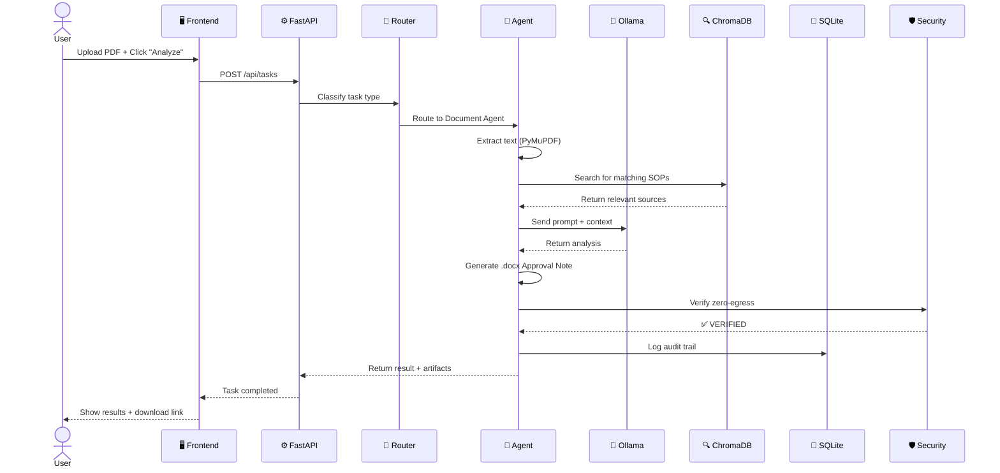

---

## 📜 License

Built for **Smart India Hackathon 2026** — Problem Statement PS-26117.
